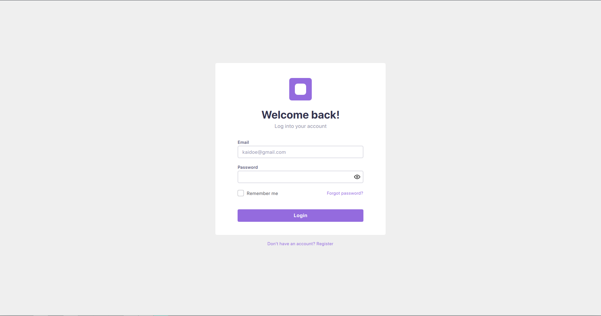
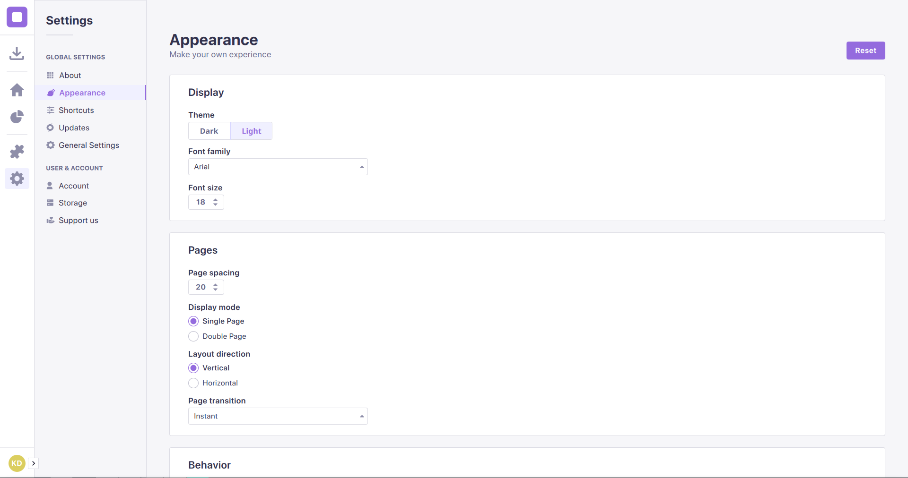
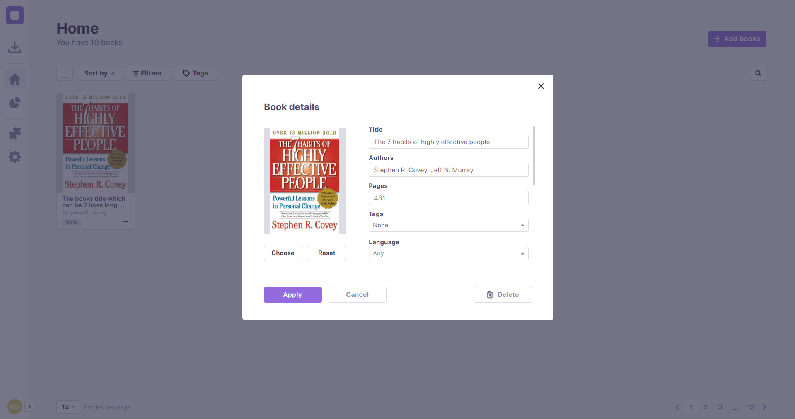

# Librum

Librum's objective is to make reading as <b>enjoyable</b> and <b>straightforward</b> as possible. <br>

Librum offers a wide range of options, that may be accessed via a modern and straightforward interface.<br>
Librum allows you to create and manage your own <b>library</b> of books and documents, which you can access from <b>any device</b>.<br>
You can <b>read</b> your book comfortably through the app, <b>highlight</b> sections that interest you, and <b>bookmark</b> pages that you wish to return to.<br>
Other features of Librum include taking <b>notes</b> directly from the app, a free in-app <b>bookstore</b>, productivity-boosting plugins, and many more.

<br>

The primary goals of Librum are to be <b>modern</b>, entirely <b>opensource</b>, <b>cost-free</b>, <b>customizable</b> and <b>fast</b>.</br>
Due to the complete copyleft license we are utilizing, anyone can download, edit, and redistribute the source code. 

<br>

<b>Note</b>: Librum currently relies on KDE's infrastructure for okular. This will change soon, however for the time being, Librum and Okular may conflict.
If there is an issue with the Librum installation, consider temporarily uninstalling okular. 

<br>

# Preview


Your entry-point to Librum

<br>


Enjoy a simple and clean look while reading

<br>


Make the application look and feel the way you want

<br>


Setup and manage your own library

<br>

# Contact


For questions, you can reach us under: librum_help@protonmail.com
<br>
For business related contact, reach out to us here: librum_reader@protonmail.com

<br>

# Details

By Librum supported platforms:
- Windows
- GNU/Linux
- MacOS
- IOS
- Android

<br>

Feature list:
- E-Book reading
- Free in-app bookstore
- Cross-platform
- Book state syncing
- Highlighting
- Bookmarks
- Tags
- Note taking
- Chapter navigation
- TTS
- Automated page scrolling
- Syncing with 3rd parties (Google drive, dropbox, nextcloud)
- Book meta-data editing
- Library management
- Custom plugins
- Fine grained appearance customization
- Application behavior customization
- Statistics (optional)
    - Total time spent read
    - Daily reading avarage
    - Days read in a row
    - Books read in a week/month/year
    - Total books read
- No-login book reading
- Sharing / Priting books

<br>

Librum supports all major book formats, these include:
- PDF
- PS
- Tiff
- CHM
- DjVu
- Images
- DVI
- XPS
- Fiction Book
- Comic Book
- Plucker
- Pub
- Fax


<br><br>

# Getting started

Instructions to get Librum up and running in your environment.

<br>

## For GNU/Linux
### Prerequisites
- cmake (at least version 3.20)     https://cmake.org/download/
- make (or any other build system)  http://ftp.gnu.org/gnu/make/
- Qt6                               https://www.qt.io/download
- Gcc (or any other c++ compiler)   https://gcc.gnu.org/

### Installation
1. Clone the repository.
    ```sh
    git clone --recurse-submodules -j8 https://github.com/Etovex/Librum.git
    ```
2. Step into the cloned project folder.
    ```sh
    cd Librum
    ```
3. Add the Qt path to the CMakeLists.txt<br>
    By default, Qt creator appends the path to Qt to the 'CMAKE_PREFIX_PATH' variable, you have 2 options for building Librum:
    <br>
    - Use Qt Creator to build the project (Simply open the CMakeLists.txt through Qt Creator, by clicking File -> Open File or Project...)
    - Add the path manually, for that, just copy this line
        ```sh
        list(APPEND CMAKE_PREFIX_PATH "/home/<username>/Qt/<Version>/<compiler>")
        ```
        to the third line of the top-level CMakeLists.txt and replace all contents in angular brackets '<>' with your data, for example:
        ```sh
        list(APPEND CMAKE_PREFIX_PATH "/home/david/Qt/6.2.3/gcc_64")
        ```
4. Create the build folder and step into it.
    ```sh
    mkdir build-Release
    cd build-Release
    ```
6. Run cmake.
    ```sh
    cmake -DCMAKE_BUILD_TYPE:STRING=Release -DBUILD_TESTS=Off ..
    ```
    If you don't want to use your default build-file generator (e.g. make, or ninja), add the -G option, e.g.
    ```sh
    -G "Ninja"
    ```
    

6. Build the project
    ```sh
    make
    ```
7. Run the app
    ```sh
    ./appLibrum
    ```
<br>


<br>

## For Windows
Not yet officially supported. Support coming soon!

## For macOS
Not yet officially supported. Support coming soon!
